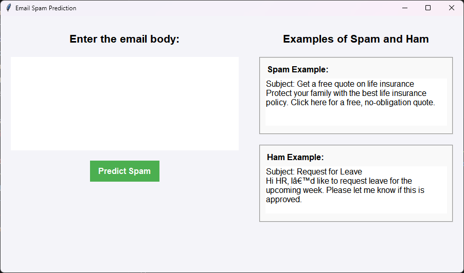

# Email Spam Detection

This project is a machine learning-based email spam detection system that predicts whether an email is **Spam** or **Ham** (legitimate). It includes a GUI interface for users to input email content and receive predictions, along with confidence scores.

## Features

- **Machine Learning Model**: Uses a trained Naive Bayes classifier or other models to detect spam.
- **GUI Application**: Simple graphical user interface built with `Tkinter` for email spam prediction.
- **Automated Setup**: Script to set up the environment, build features, train the model, and run the application.

---

## Project Structure

```plaintext
LICENSE
Makefile                      <- Makefile with commands like `make data` or `make train`
README.md                     <- The top-level README for developers using this project.
data
├── example-emails            <- Folder containing examples of spam and ham emails
│   ├── ham_emails.txt        <- Text file with ham (legitimate) email examples
│   └── spam_emails.txt       <- Text file with spam email examples
├── external                  <- Data from third-party sources
├── interim                   <- Intermediate data that has been transformed
│   ├── parsed_emails.csv     <- CSV file with parsed emails, labeled as spam or ham
├── processed                 <- The final, canonical data sets for modeling
│   ├── processed_email.csv   <- CSV file with processed email content
│   ├── test_data.pkl         <- Pickle file containing the test data split
│   └── train_data.pkl        <- Pickle file containing the training data split
└── raw                       <- The original, immutable data dump
    ├── easy_ham              <- Folder containing raw ham emails
    ├── hard_ham              <- Folder containing raw hard ham emails
    ├── spam_2                <- Folder containing raw spam emails
    └── test                  <- Folder with test raw emails

docs                          <- A default Sphinx project; see sphinx-doc.org for details

logs                          <- Directory for log files
├── model_training.log        <- Log file recording model training steps and outputs

models                        <- Trained and serialized models, model predictions, or model summaries
├── spam_classifier_model.pkl <- The saved trained spam classifier model
├── tfidf_vectorizer.pkl      <- The saved TF-IDF vectorizer used for text preprocessing

notebooks                     <- Jupyter notebooks for exploratory data analysis and prototyping
└── email-spam-notebook.ipynb <- Jupyter notebook for working with email data for spam detection

reports                       <- Generated analysis as HTML, PDF, LaTeX, etc.
└── figures                   <- Generated graphics and figures to be used in reporting
    └── Notebook.pdf          <- PDF document with project or notebook summary

requirements.txt              <- The requirements file for reproducing the analysis environment
                               e.g. `pip freeze > requirements.txt`

src                           <- Source code for use in this project.
├── __init__.py               <- Makes `src` a Python module
│
├── data                      <- Scripts to download, parse, or generate data
│   ├── make_dataset.py       <- Script to create the dataset from raw emails
│   └── parse_email.py        <- Script for parsing raw email data
│
├── features                  <- Scripts to turn raw data into features for modeling
│   ├── build_features.py     <- Script to preprocess and build feature sets
│   ├── over_sampling.py      <- Script for oversampling data (e.g., SMOTE)
│   ├── preprocessing.py      <- Script for cleaning and preprocessing email text
│   ├── train_test_split.py   <- Script to split data into training and testing sets
│   └── vectorizing.py        <- Script for vectorizing email text (e.g., TF-IDF)
│
├── gui                       <- GUI (Graphical User Interface) scripts
│   └── run_app.py            <- Script to run the email spam prediction app with Tkinter
│
└── models                    <- Scripts to train models and make predictions
    ├── predict_model.py      <- Script for predicting spam/ham using the trained model
    └── train_model.py        <- Script to train the spam classifier

setup.py                      <- Script to automate setup, training, and running the app

tox.ini                       <- tox file with settings for running tox; see tox.readthedocs.io
```

## Setup Instructions

### For Windows Users

1. **Clone the Repository**:
    ```bash
    git clone https://github.com/yourusername/email-spam-detection.git
    cd email-spam-detection
    ```

2. **Run the Batch File (`setup.bat`)**:
    - Open the project directory and double-click the `setup.bat` file, or run it from the command line:
    ```bash
    setup.bat
    ```

    This will:
    - Create a virtual environment in the `venv` folder.
    - Install the required libraries from `requirements.txt`.
    - Check for pre-existing models, train if necessary, and start the GUI application.

---

### For Mac/Linux Users

1. **Clone the Repository**:
    ```bash
    git clone https://github.com/yourusername/email-spam-detection.git
    cd email-spam-detection
    ```

2. **Run the Makefile**:
    In your terminal, simply run:
    ```bash
    make run_app
    ```

    This will:
    - Create a virtual environment in the `venv` folder.
    - Install the required libraries from `requirements.txt`.
    - Check for pre-existing models, train if necessary, and start the GUI application.

---

## Running the GUI Application

Once the setup is complete, the application will launch a simple **Email Spam Prediction** interface where you can input the content of an email and check whether it's classified as spam or ham.

- **Enter Email Body**: Type in or paste the content of an email.
- **Predict Spam**: Click the button to get the prediction and confidence score.
- **Example Spam and Ham**: The app also displays changing examples of spam and ham emails on the side.

### Sample GUI Screenshot:

You can add a screenshot of the app here:



---

## Dependencies

- `Python 3.11`
- `Tkinter`
- `scikit-learn`
- `nltk`
- `pandas`
- `joblib`

The full list of dependencies is available in `requirements.txt`.

---

## Future Improvements

- Implement more machine learning models to compare performance.
- Extend the application to detect phishing emails.
- Add more robust spam examples and real-time email stream input for prediction.

---

## License

This project is licensed under the MIT License - see the [LICENSE](LICENSE) file for details.

---
